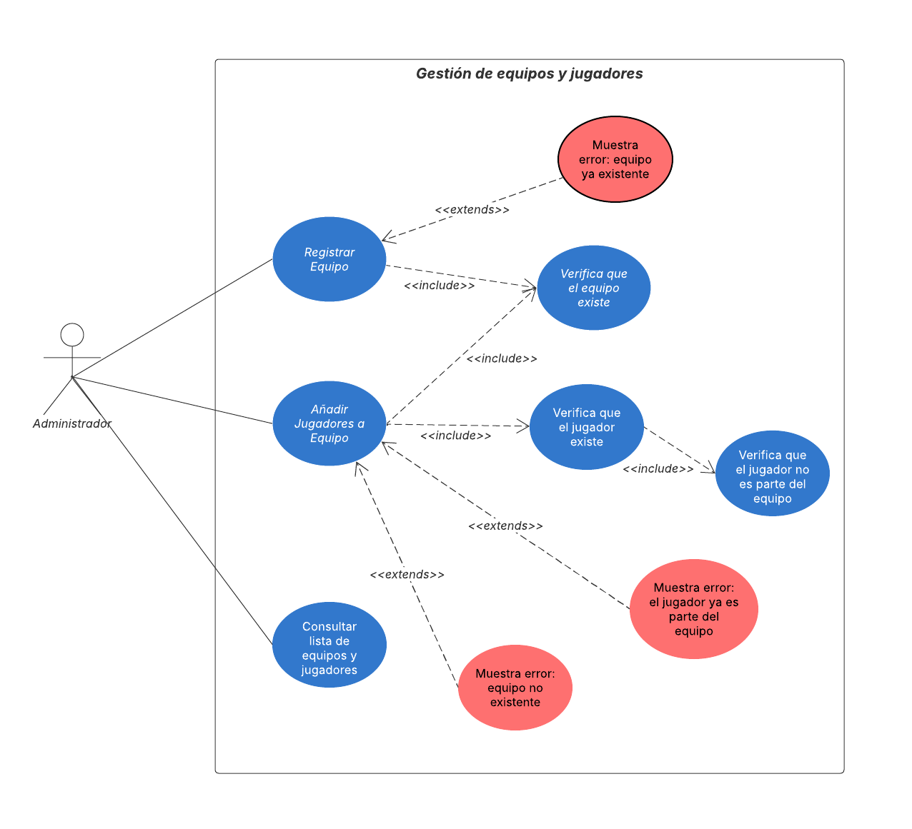
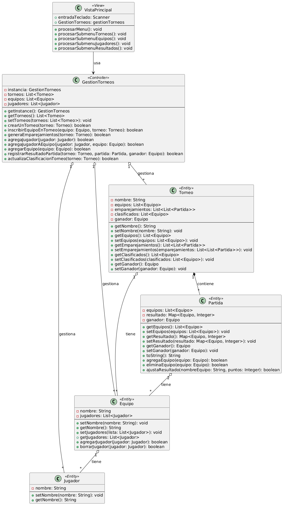

# Sistema de gestión de torneos para e-Sports
Actividad 3 para la asignatura de Entornos de Desarrollo.

## Autor
Casandra Carolina Iglesias Martínez
https://github.com/cciglesiasmartinez

## Descripción del proyecto
https://github.com/cciglesiasmartinez/IMCC_Actividad3Entornos

Este proyecto implementa un sistema de gestión de torneos para e-Sports utilizando UML para el modelado y Java para la implementación.

## Diagramas UML
### Diagrama de casos de uso


### Diagrama de clases


## Estructura del proyecto
```
src/
	es/empresa/torneo/
		modelo/
		control/
		vista/
		Main.java
	diagrams/
		casos-uso.png
		clases.png
README.md
.gitignore
```

## Instalación y ejecución
1. Clonar el repositorio:
`git clone https://github.com/cciglesiasmartinez/IMCC_Actividad3Entornos.git`

2. Compilar y ejecutar el proyecto:
`cd src javac es/empresa/torneo/Main.java java es.empresa.torneo.Main`

## Justificación del diseño
He decidido emplear la estructura actual mayormente por su sencillez, para proporcionar un prototipo sencillo capaz de demostrar la funcionalidad mínima del proyecto. Por este hecho he decidido emplear únicamente un almacenamiento en memoria a base de ArrayLists en vez de aplicar un patrón DAO con acceso a base de datos.

Además, he decidido emplear relaciones de agregación entre casi todas las clases del modelo para evitar en todo lo posible el acoplamiento, de modo que coexistan jugadores y equipos de manera independiente, pudiendo eliminar equipos o jugadores sin afectarse entre ellos. La única excepción a esto son las partidas, que son dependientes del torneo.

## Conclusiones
